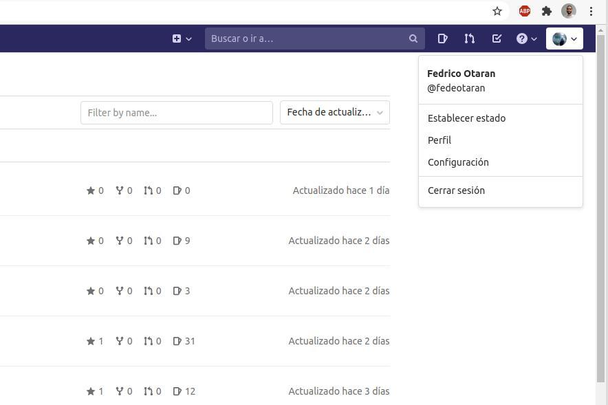

# Agregar la clave SSH en Gitlab

Esta guía tiene como objetivo mostrar cómo agregar una clave SSH en Gitlab.
La clave SSH es necesaria para poder realizar operaciones de Git de forma segura.

<!-- more -->

1. Primero necesitamos crear nuestra clave SSH y copiarla en el clipboard. Esto
   se puede ver en [esta guía](02_ssh.md).
2. Luego debe ir al Gitlab de la cátedra https://gitlab.catedras.linti.unlp.edu.ar/
   e iniciar sesión.
3. Selecciona en tu avatar en la esquina superior derecha y hace click en
   **Cónfiguración**.
    
4. Selecciona **Claves SSH**.
5. Pega la clave pública que copiaste en el paso uno en el textarea.
6. Asegurate de incluir un nombre descriptivo a tu clave en el input **Título**,
   como *PC de casa*.
7. Opcionalmente se puede poner una fecha de expiración a la clave.
8. Selecciona el botón **Añadir clave**

   
