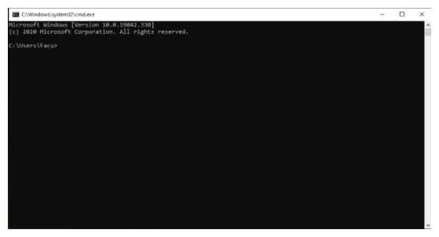

# Instalación de Python

En esta guía vamos a ver distintas formas de realizar la instalación de
la versión específica de **Python** que se utilizará en la cátedra para distintos
sistemas operativos.

El objetivo es que todos los alumnos que cursen la cátedra puedan instalar
en sus sistemas operativos la versión específica de **Python** que vamos a usar
dentro de la cátedra.

<!-- more -->

El mecanismo para esto es utilizar una herramienta de manejo de versiones para
**Python** (Python Versión Manager) en los sistemas operativos Linux y MacOS.

En el caso del sistema operativo Windows no vamos a usar esta herramienta ya
que no funcionan del todo bien, y tampoco algunas alternativas que probamos. En
este caso vamos a instalar la versión específica de **Python** que utilicemos.

## ¿Por qué usar una herramienta para manejar versiones?

La idea de usar este tipo de herramientas son:

- Instalar prácticamente cualquier versión de **Python** (o del lenguaje que sea)
- Permitir tener instaladas múltiples versiones

Otro objetivo para esta cátedra es lograr que todos ustedes tengan exactamente
la misma versión de **Python**.

La herramienta que vamos a usar es [`pyenv`](https://github.com/pyenv/pyenv)

## Linux y MacOS

### Dependencias necesarias

Para que `pyenv` puede realizar la instalación de las distintas versiones de `Python`
de manera correcta es necesario contar algunas dependencias de su sistema operativo.
Dependiendo del mismo las instrucciones de instalación pueden encontrarse en el
siguiente enlace de la documentación de `pyenv` - [Suggested build environment](https://github.com/pyenv/pyenv/wiki#suggested-build-environment).

### Instalación con Git (Linux y MacOS) RECOMENDADA

Hacer el _checkout_ de `pyenv` en el directorio donde quieras que se instale.
Un buen lugar puede ser `$HOME/.pyenv`.

```bash
git clone https://github.com/pyenv/pyenv.git ~/.pyenv
```

Define la variable de entorno `PYENV_ROOT` para tener disponible el _path_ donde
fue clonado el repositorio y agrega `$PYENV_ROOT/bin` a la variable `$PATH` para
tener acceso al comando `pyenv` en la terminal.

```bash
echo 'export PYENV_ROOT="$HOME/.pyenv"' >> ~/.bash_profile
echo 'export PATH="$PYENV_ROOT/bin:$PATH"' >> ~/.bash_profile
```

!!! warning

    - Si usas **ZSH** modifica el comando con `~/.zshrc` en lugar de
    `~/.bash_profile`.
    - Para **Ubuntu** y **Fedora** usa `~/.bashrc` en lugar de
    `~/.bash_profile`.

Finalmente para terminar de configurarlo y tener el autocompletado en la consola
ejecuta el siguiente comando:

```bash
echo -e 'if command -v pyenv 1>/dev/null 2>&1; then\n  eval "$(pyenv init -)"\nfi' >> ~/.bash_profile
```

!!! warning
    Al igual que en el paso anterior reemplaza con `~/.zshrc` o `~/.bashrc` en
    el comando según corresponda.

Luego reiniciar la terminal para que tome los cambios.

!!! info
    Guía completa en el [README de pyenv](https://github.com/pyenv/pyenv).

### Instalación con brew (MacOS)

Se puede instalar `pyenv` usando el manejador de paquetes
[Homebrew](https://brew.sh/) para MacOS.

```bash
brew update
brew install pyenv
```

### Uso de `pyenv`

Para buscar que versión de **Python** queremos instalar podemos usar:

```bash
pyenv install 3.12.9
```

Ahora podemos seleccionar esta versión como global

```bash
pyenv global 3.12.9
```

o como versión local en el directorio que nos encontremos

```bash
pyenv local 3.12.9
```

## Instalación en Windows

Estos son los enlaces para los ejecutables de Windows:

- [Instalador ejecutable para Windows 32bits](https://www.python.org/ftp/python/3.12.9/python-3.12.9.exe)
- [Instalador ejecutable para Windows 64bits](https://www.python.org/ftp/python/3.12.9/python-3.12.9-amd64.exe)

Si necesita alguna alternativa distinta pueda obtener más opciones en el
[siguiente enlace](https://www.python.org/downloads/release/python-3129/).

Al descargar el instalador debe ejecutarlo y seguir los pasos que ofrece.
La primer ventana que se puede visualizar el la siguiente:

<center>

</center>

Si es la primer versión de Python que instala se recomienda seguir la instalación simple ("Install Now" en la imagen).

!!! warning
    Tener en cuenta de seleccionar el checkbox de abajo para agregar el ejecutable de
    Python al PATH del sistema. Esto es fundamental para poder ejecutar Python correctamente.

    

Si todo salió correctamente debería ver una imagen similar a esta:

<center>

</center>

### Chequeo de variable de entorno

Para verificar si tenemos Python correctamente instalado vamos a hacer uso de una terminal o consola de comandos.

Para abrir el `cmd` tenemos al menos las siguientes dos opciones:

- En el buscador de windows ponemos "cmd" y seleccionamos la primer opción.
<center>


</center>
- Presionamos las teclas `win` + `R`, ponemos "cmd", presionamos `enter`.
<center>

</center>

Para cualquiera de las opciones nos tiene que abrir la siguiente ventana:

<center>

</center>

Para verificar si la instalación de Python fué correcta vamos a ejecutar el intérprete interactivo de Python.
Lo podemos abrir escribiendo "python" en el cmd y prescionando la tecla `enter`.
Debería aparecer algo como esto:

<center>

</center>

En esta terminal interactiva ya podemos ejecutar código Python.
