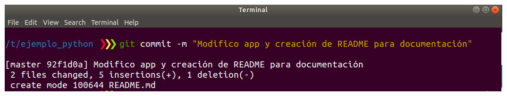

# Git básico

## Introducción

Como ya vimos **Git** es una herramienta muy buena que nos permite manejar
versiones de nuestro código de manera distribuida con nuestro equipo de
trabajo.

Para poder realizar esto es necesario contar con un **Servidor de
Git** aparte de tener la herramienta instalada en su máquina.

En esta oportunidad vamos a analizar un poco [GitHub](https://github.com/) que
es el **Servidor de Git** más popular actualmente.

## Crear una cuenta de Github

Para crear una cuenta tienen que entrar a la
[web de Github](https://github.com/) y registrarse (Sing up).

## Crear repositorio en Git

Ahora vamos a crear nuestro primer repositorio en **Git**, agregarle algunos
archivos y publicarlos en el Servidor de git GitHub.

Realiza la instalación de la herramienta **Git** en tu máquina. Tienes una guía
provista por la cátedra en el [siguiente enlace](../03/git.md).

!!! info

    Recorda también realizar la correcta configuración de Git antes de
    usarlo poniendo tu _nombre_ y tu _mail_ que serán datos requeridos para
    cuando quiera hacer tu primer commit.

Crear un repositorio local con **Git** en tu máquina dentro de un directorio
llamado `ejemplo_python`.

```bash
mkdir ejemplo_python
```

```bash
git init
```


Mueve dentro de este directorio el programa `run.py` que escribiste en el punto
2 de la sección Python.

```bash
cd ejemplo_python
```

Ahora notarás que hay cambios en tu **repositorio Git local**:

```bash
git status
```


!!! warning
Recorda siempre elegir un mensaje adecuado para los commits cuando uses **Git**.

Para agregar este archivo al versionado de **Git** debemos ejecutar:

```bash
git add app.py
```


Procede a crear el primer commit con ese archivo.

```bash
git commit -m "Mensaje de commit"
```


Agrega un `README.md` que servirá de documentación para el repositorio donde
esté el nombre y número de alumno escrito. Modifica la aplicación principal
también. **Nuevamente notarás cambios en el repositorio local**.


Crea un segundo commit



Hasta el momento todos las acciones realizadas fueron en tu máquina.

Ahora llega el turno de interactuar con el **Servidor de Git** (Github en
este caso) que es el lugar en donde estará disponible el código para
compartirlo.

!!! info

    Para esto es necesario que tengas una cuenta en Github así que si no
    cuentas con una aún puedes [crearla aquí](https://github.com/join).


Para usar GitHub de forma segura tienes dos opciones:

- Generar una clave SSH y agregarla al usuario (Este es lo recomandado. Seguir
  la guía de [SSH](../05/ssh.md)).
- Usar el método HTTP, pero deberás escribir tu usuario y contraseña para cada
  operación con el servidor Github.

Con tu cuenta creada debes crear tu repositorio remoto dentro de Github.

Con tu nuevo repositorio creado resta realizar el enlace entre el repositorio
local en el que viniste trabajando y el repositorio remoto que recién se creó.
Para eso tienes que actualizar tu remote dentro de tu repositorio local con la
url del repositorio remoto (ver comandos sugeridos al crear el repositorio en Github).

Si todo está correctamente configurado, sólo resta hacer el "push" de los cambios.
